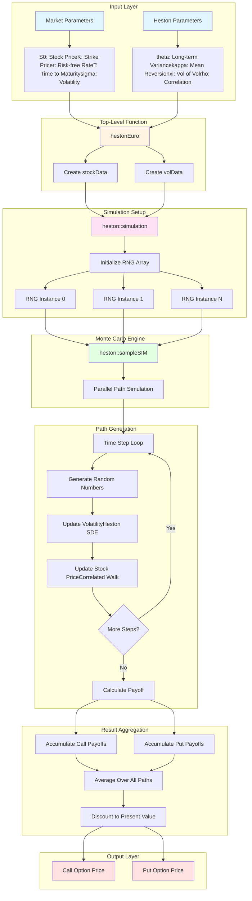
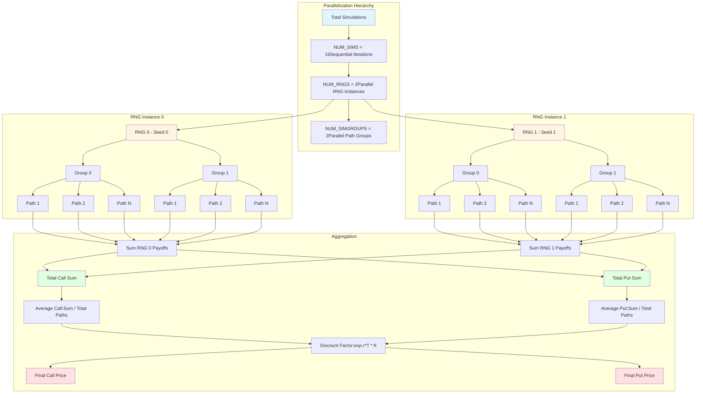
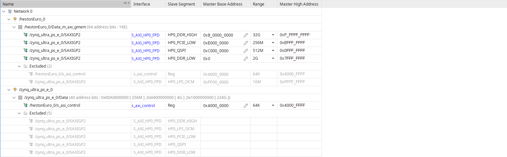

# Heston European Option Pricing Engine

## Repository Description

This repository contains a hardware-accelerated implementation of the Heston stochastic volatility model for pricing European call and put options. The code is written in C++ and optimized for synthesis on Xilinx Zynq UltraScale+ FPGAs using Vitis HLS. The implementation uses Monte Carlo simulation with parallel random number generators to compute option prices efficiently in hardware.

## Basic Financial Concepts

### What is an Option?

An option is a financial contract that gives the buyer the right, but not the obligation, to buy or sell an asset at a predetermined price on or before a specific date.

- Call Option: The right to buy an asset at a specified price
- Put Option: The right to sell an asset at a specified price
- European Option: Can only be exercised on the expiration date (not before)

### Key Variables

#### Stock Parameters

**S0 (Initial Stock Price)**
- Current market price of the underlying stock
- Units: Currency (e.g., dollars)
- Example: S0 = 100 means the stock currently trades at $100

**K (Strike Price)**
- The predetermined price at which the option can be exercised
- Units: Currency (e.g., dollars)
- Example: K = 105 means you can buy/sell at $105 regardless of market price

**r (Risk-Free Rate)**
- The theoretical return on a risk-free investment (e.g., government bonds)
- Units: Decimal (e.g., 0.05 = 5% annual return)
- Formula: Future Value = Present Value * exp(r * T)

**T (Time to Maturity)**
- Time remaining until the option expires
- Units: Years
- Example: T = 0.5 means 6 months until expiration

**sigma (Volatility)**
- Measure of how much the stock price fluctuates
- Units: Decimal (e.g., 0.20 = 20% annual volatility)
- Higher volatility means more uncertainty and higher option prices

#### Heston Model Parameters

The Heston model assumes that volatility itself changes randomly over time, following its own stochastic process.

**theta (Long-Term Variance)**
- The average level that variance tends to return to over time
- Units: Variance (volatility squared)
- Example: theta = 0.04 corresponds to 20% long-term volatility

**kappa (Mean Reversion Speed)**
- How quickly volatility returns to its long-term average
- Units: 1/Time
- Higher kappa means faster mean reversion
- Example: kappa = 2.0 means volatility adjusts relatively quickly

**xi (Volatility of Volatility)**
- How much the volatility itself fluctuates
- Units: Square root of variance per square root of time
- Example: xi = 0.3 means moderate fluctuation in volatility

**rho (Correlation)**
- Correlation between stock price changes and volatility changes
- Units: Dimensionless (-1 to +1)
- Typically negative: when stock drops, volatility rises
- Example: rho = -0.5 means moderate negative correlation

### Put-Call Parity

For European options, there exists a fundamental relationship that must hold to prevent arbitrage:

```
C - P = S0 - K * exp(-r * T)
```

Where:
- C = Call option price
- P = Put option price
- S0 = Current stock price
- K = Strike price
- r = Risk-free rate
- T = Time to maturity

This equation states that the difference between a call and put price must equal the difference between the current stock price and the present value of the strike price.

### Option Payoffs

At expiration, the option value depends on the final stock price (ST):

**Call Option Payoff:**
```
Payoff = max(ST - K, 0)
```
- Profitable if ST > K
- Worthless if ST <= K

**Put Option Payoff:**
```
Payoff = max(K - ST, 0)
```
- Profitable if ST < K
- Worthless if ST >= K

## System Overview

### System Architecture Diagram



### Component Descriptions

**hestonEuro (Top-Level Function)**
- Entry point for the HLS IP core
- Defines AXI interfaces for FPGA integration
- Packages parameters into data structures

**RNG (Random Number Generator)**
- Implements Mersenne Twister algorithm (MT19937)
- Generates uniformly distributed random integers
- Box-Muller transform converts to Gaussian distribution
- Parallelized for hardware efficiency

**stockData**
- Container for stock-related parameters
- Stores S0, K, r, T, sigma

**volData**
- Container for Heston model parameters
- Stores theta, kappa, xi, rho

**heston Class**
- Orchestrates the Monte Carlo simulation
- Manages parallel simulation paths
- Accumulates and averages results

### Parallelization Strategy



Total Simulation Paths:
```
Total Paths = NUM_RNGS * NUM_SIMGROUPS * NUM_SIMS

Default Configuration:
- NUM_RNGS = 2      (parallel RNG instances)
- NUM_SIMGROUPS = 2 (simulation batches per RNG)
- NUM_SIMS = 16     (Monte Carlo iterations)
- NUM_STEPS = 16    (time discretization steps)

Total = 2 * 2 * 16 = 64 parallel paths
```

## File Structure

```
heston_project/
├── hestonEuro.cpp           Main pricing function
├── hestonEuro.h             Header file
├── hestonEuro_tb.cpp        Test bench with 6 test cases
├── run_hls.tcl              HLS script (100 MHz target)
└── common/
    ├── RNG.cpp              Random number generator
    ├── RNG.h
    ├── stockData.cpp        Stock parameters
    ├── stockData.h
    ├── volatilityData.cpp   Heston parameters
    └── volatilityData.h
```

## Running the Project

### HLS 

Run Vitis HLS to generate RTL for FPGA implementation:

```bash
source /PATH_TO_VITIS_HLS/2023.2/settings64.sh
vitis_hls run_hls.tcl
```

This performs:
1. C Simulation - Functional verification
2. C Synthesis - RTL generation
3. C/RTL Co-simulation - Hardware verification
4. Export Design - IP packaging

## Hardware 

Here is a screenshot of our block diagram that is used to run on the ZCU102:


And here is the corresponding address space:




## Petalinux Deployment

### Overview
PetaLinux creates a complete Linux boot environment for the ZCU102, enabling the Heston option pricing application to run on the ARM Cortex-A53 processor with FPGA acceleration.

### Build Process
```bash
# Create PetaLinux project
petalinux-create -t project --template zynqMP -n heston_project
cd heston_project

# Configure with hardware design
petalinux-config --get-hw-description=/path/to/design_1_wrapper.xsa

# Build Linux system
petalinux-build

# Generate boot image
petalinux-package --boot --fsbl images/linux/zynqmp_fsbl.elf \
  --u-boot images/linux/u-boot.elf --pmufw images/linux/pmufw.elf \
  --fpga images/linux/system.bit --force
```

### Output Files
- **BOOT.BIN**: Unified boot image (FSBL + PMU firmware + bitstream + U-Boot)
- **image.ub**: Linux kernel + device tree
- **boot.scr**: U-Boot boot script
- **rootfs.tar.gz**: Root filesystem

### Cross-Compile Application
```bash
# Generate and install SDK
petalinux-build --sdk
petalinux-package --sysroot
./images/linux/sdk.sh -d ~/petalinux_sdk

# Source cross-compilation environment
source ~/petalinux_sdk/environment-setup-cortexa72-cortexa53-xilinx-linux

# Compile application for ARM
$CXX -O2 hestonEuro_tb.cpp hestonEuro.cpp common/*.cpp \
  -o heston_test -I./common -std=c++11
```

### Boot and Run
1. Set SW6[4:1] = `1110` (SD boot mode)
2. Insert SD card, connect UART (115200 baud)
3. Power on ZCU102
4. Login: `root` / `root`
5. Execute: `./heston_test`

## Test Cases

The test bench includes 6 scenarios:

1. At-The-Money Option (S0 = K = 100)
2. In-The-Money Call (S0 = 110, K = 100)
3. Out-of-The-Money Call (S0 = 90, K = 100)
4. Short Time to Maturity (T = 0.1 years)
5. High Volatility (sigma = 50%)
6. Low Volatility (sigma = 10%)

## Expected Output

The output of our model produces a Call option price and a Put option price. 
The Put-Call partiy error is a check of our option output prices to ensure that they are correlated enough to prevent arbitrage. 

Put-Call parity errors should be:
- Normal volatility: 0.02 to 0.08 (acceptable)
- High volatility: 0.5 to 1.0 (marginal)
- Target: Less than 0.10 for production use

Typical errors:
- At-The-Money: 0.04 to 0.05
- In/Out-of-The-Money: 0.04 to 0.06
- Short maturity: 0.05 to 0.08
- High volatility: 0.70 to 1.00

## Sources

- [HestonModel_MonteCarlo](https://github.com/max2ma/HestonModel_MonteCarlo)
- [F1 Acceleration for Montecarlo: financial algorithms on FPGA](https://www.bing.com/ck/a?!&&p=1bdcdb2d1c8b3941507fee9866ec7ce412bb5a3aa7a144567caa6737723a7b3dJmltdHM9MTc2MzUxMDQwMA&ptn=3&ver=2&hsh=4&fclid=06e47829-0bb1-6e5e-204f-6b970a696fd1&psq=F1+Acceleration+for+Montecarlo%3a+financial+algorithms+on+FPGA&u=a1aHR0cHM6Ly93d3cueGlsaW54LmNvbS9wdWJsaWNhdGlvbnMvZXZlbnRzL2RldmVsb3Blci1mb3J1bS8yMDE4LWZyYW5rZnVydC9mMS1hY2NlbGVyYXRpb24tZm9yLW1vbnRlY2FybG8tZmluYW5jaWFsLWFsZ29yaXRobXMtb24tZnBnYS5wZGY))
- [Acceleration of financial Monte-Carlo simulations using FPGAs](https://ieeexplore.ieee.org/document/5671823)